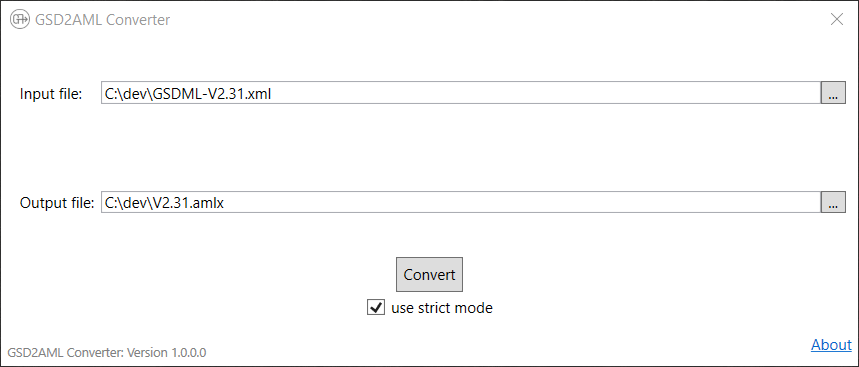
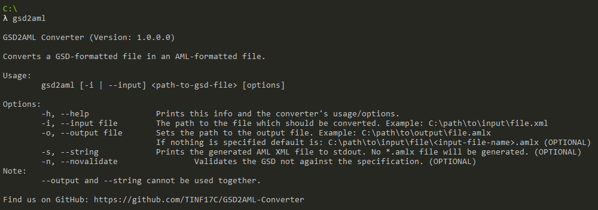

# Gsd2Aml

Welcome to the Gsd2Aml! This project was developed as a student project by (in alphabetical order)

1. Nico Dietz
2. Steffen Gerdes
3. Constantin Ruhdorfer
4. Jonas Komarek
5. Phuc Quang Vu
6. Michael Weidmann

at [Cooperate State University Stuttgart](https://www.dhbw-stuttgart.de/home/).
This project is distributed via:

1. [GitHub](https://github.com/TINF17C/GSD2AML-Converter)
2. [NuGet](https://www.nuget.org/packages/Gsd2Aml.Lib)

We can be found as a [GitHub Team](https://github.com/orgs/TINF17C/teams/gsd2aml).

## About this project

This project was developed in .Net Framework 4.7.
This project converts a Profinet (PN-)GSD file to AutomationML.
There are several ways to use this project:

1. GUI
2. CLI
3. Implement the library for your own purposes

You can get an installer or a portable version on the appropiate GitHub release page.

## Contributing to this project

Contributions are always welcome!
If you want to contribute feel free to fork this repo and later perform a pull request.

## Subprojects

The seperate subprojects are explained here and can be found under /src/.

### Gsd2Aml.Lib

The heart of this project.
The library contains all the relevant logic for:

1. checking the GSD files validity
2. performing the conversion and either
    * returning a string containing the AutomatonML content.
    * or converting the GSD file to an .aml file and package that, including all its dependencies, into an .amlx package. This process uses the [AML.Engine](https://www.nuget.org/packages/Aml.Engine).

Additional information, including the relevant conversion rules, can be found in the readme of the [library](src/Gsd2Aml.Lib/README.md).

### Gsd2Aml.Gui

Contains the code that makes up the CLI.
The Gui gives the user access to the functonality of the library without requiring the user to implement the library for themselfs.
It comes with added functionality like checking paths and visually informing the user about events.

### Gsd2Aml.Cli

Contains the code that makes up the CLI.
This includes parsing and handeling the arguments.
The CLI gives the user access to the functonality of the library without requiring the user to implement the library for themselfs.

It comes with various flags to handle the conversion:

### Gsd2Aml.Setup

Contains the code relevant for building the installer.
It uses the [WIX toolset](http://wixtoolset.org/).

### Gsd2Aml.Test

Contains the code for all unit tests.
The unit tests were build with Microsoft Unit Test Framework.
